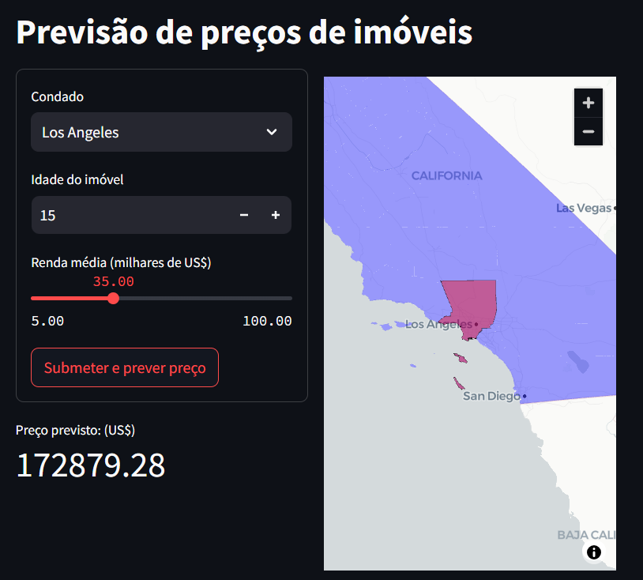

# Projeto de previsão de preços de casas no estado da Califórnia

Este projeto de regressão tem como objetivo analisar dados relacionados ao censo americano de 1990, em busca de construir um modelo preditivo que estime os valores de habitação com base em diversas variáveis socioeconômicas e geográficas relacionando-se a cada condado do estado da Califórnia. Além disso, foi desenvolvido um aplicativo interativo que permite ao usuário visualizar e descobrir o preço médio dos imóveis por região de forma intuitiva.



Nos Estados Unidos, existem um total de 50 estados, e cada um deles é dividido por condados. Os condados são unidades administrativas que agrupam várias cidades dentro de uma mesma região geográfica e possuem sua própria administração, sendo responsáveis por fornecer serviços públicos aos moradores. 

Por exemplo, a cidade de Los Angeles pertence ao condado homônimo. No entanto, cidades como San Francisco e San Diego não fazem parte desse condado, pois cada uma pertence ao seu próprio condado dentro do estado da Califórnia.


## Os objetivos principais deste projeto, foram:

### 1. Tratamento da base de dados e organização dos dados geográficos:

A primeira etapa do projeto envolveu a limpeza e preparação dos dados. Foram verificadas a presença de valores nulos e duplicados, além da criação de novas variáveis, como:

- `rooms_per_household`: média de quartos por residência,
- `people_per_household`: média de pessoas por residência,
- `bedrooms_per_room`: proporção de quartos por cômodo.

Além disso, foram removidos valores extremamente discrepantes e ajustados os tipos de dados das colunas, garantindo melhor organização da base. Alguns outliers foram mantidos para evitar comprometer a integridade dos resultados e a eficácia do modelo.

Na etapa seguinte, os dados geográficos foram processados utilizando GeoPandas e Folium. As coordenadas de latitude e longitude foram cruzadas com o arquivo california_counties.json, permitindo associar cada imóvel ao seu respectivo condado. Para registros localizados fora dos limites terrestres, os dados foram ajustados com base no condado mais próximo. Também foram definidos a latitude e longitude médias de cada condado e sua proximidade com o oceano. Por fim, realizamos uma análise exploratória para entender a distribuição da renda média e dos preços dos imóveis por região.

### 2. Construção de um modelo de regressão:

Para a modelagem preditiva, foram desenvolvidos pipelines de processamento para facilitar a aplicação dos algoritmos de Machine Learning. Testamos diferentes abordagens, incluindo:

- Pré-processamento de variáveis categóricas,
- Modelagem polinomial para capturar relações não lineares,
- Implementação dos modelos ElasticNet e Ridge Regression, que apresentaram melhor desempenho em comparação com outras abordagens testadas.
 
A escolha final do modelo foi baseada em métricas como RMSE (Root Mean Squared Error) e R² (coeficiente de determinação), garantindo um equilíbrio entre viés e variância para previsões mais precisas.

# 3. Construção de um aplicativo no streamlit:

Para tornar a análise mais acessível, desenvolvemos uma aplicação interativa utilizando Streamlit. O código foi implementado no arquivo home.py, permitindo que o usuário:
- Selecione um condado (ex: Los Angeles),
- Insira a idade do imóvel e a renda média da região,
- Obtenha o preço estimado do imóvel,
- Visualize um mapa com a localização do condado selecionado.

Essa interface facilita a exploração dos dados e possibilita previsões de preços de forma intuitiva e interativa.

## [Clique aqui](https://projetoregressaocalifornia.streamlit.app/) para acessar o aplicativo


## 4. Próximos passos:

Os próximos passos deste projeto envolvem aprimorar o aplicativo no Streamlit. O primeiro objetivo é criar um card de destaque para exibir o preço previsto de forma mais visível e intuitiva, além de melhorar o design geral, proporcionando uma experiência mais agradável para o usuário.

Além disso, em vez de utilizar um botão de submeter, o sistema permitirá que os valores sejam atualizados automaticamente em tempo real. Assim, o preço previsto será ajustado instantaneamente à medida que o usuário modificar variáveis como a idade do imóvel e a renda média.

Por fim, será implementada uma otimização no comportamento do mapa interativo. O mapa será recarregado apenas quando houver uma alteração significativa, como a troca de condado (por exemplo, de Los Angeles para San Diego), evitando recarregamentos desnecessários a cada modificação.

## Um pouco mais sobre a base

[Clique aqui](referencias/01_dicionario_de_dados.md) para ver o dicionário de dados da base utilizada

## Organização do projeto

```
├── .env                 <- Arquivo de variáveis de ambiente (não versionar)
├── .gitignore           <- Arquivos e diretórios a serem ignorados pelo Git
├── home.py              <- Arquivo de construção do aplicativo do Streamlit
├── LICENSE              <- Licença de código aberto (MIT)
├── README.md            <- README principal para desenvolvedores que usam este projeto.
├── requirements.txt     <- O arquivo de requisitos (bibliotecas) para reproduzir o aplicativo do Streamlit
|
├── dados                <- Arquivos de dados para o projeto.
|
├── modelos              <- Modelos treinados e serializados, previsões de modelos ou resumos de modelos
|
├── notebooks            <- Arquivos de código em Jupyter Notebook
│
|   └──src               <- Código-fonte para uso neste projeto.
|      │
|      ├── __init__.py   <- Torna um módulo Python
|      ├── auxiliares.py <- Funções estatísticas para o cálculo de coeficientes
|      ├── config.py     <- Configurações básicas do projeto
|      ├── graficos.py   <- Funções para construção de gráficos de resíduos e de métricas
|      └── models.py     <- Funções para construção de modelo e de comparação de métricas
|
├── referencias          <- Dicionários de dados, manuais e todos os outros materiais explicativos.
|
├── imagens              <- Imagens utilizadas no projeto
```

## Configuração do ambiente

1. Faça o clone do repositório que será criado a partir deste modelo.

    ```bash
    git clone git@github.com:RichardRafi/projeto_regressao_california.git
    ```

2. Crie um ambiente virtual para o seu projeto utilizando o gerenciador de ambientes de sua preferência.

    a. Caso esteja utilizando o `conda`, exporte as dependências do ambiente para o arquivo `enviroment.yml`:

2. Crie um ambiente virtual para o seu projeto utilizando o 'conda'.


    ```bash
    conda env create -f enviroment.yml --name av_machine_learning
    ```

Nota: Caso haja problemas para exportar o arquivo `environment.yml` para o cloud da Streamlit, utilize o requirements.txt no lugar para não ocorrer problemas na execução do aplicativo.
